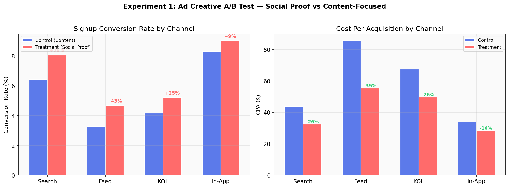
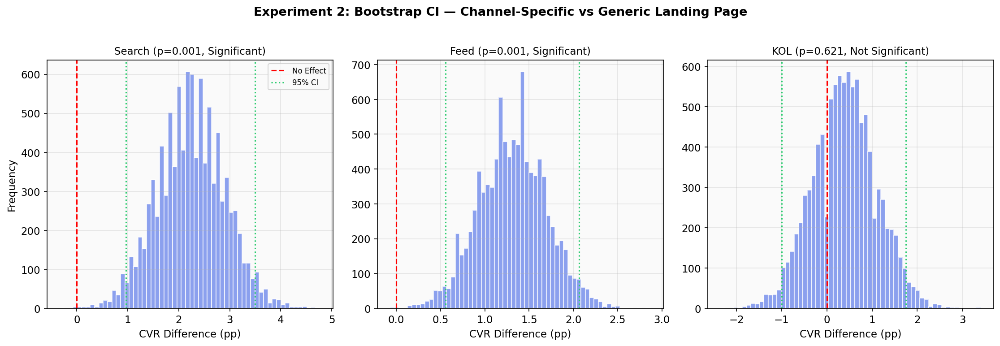
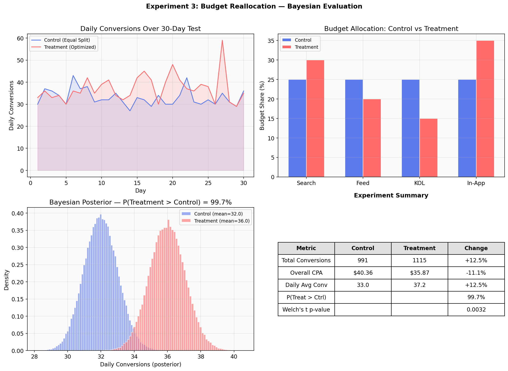

# A/B Testing Analysis — Online Course Advertising Optimization

Statistical experimentation framework for evaluating multi-channel advertising strategies on an online learning platform. Three experiments test ad creatives, landing page personalization, and budget allocation to maximize signups while reducing acquisition cost.

## Business Context

An online education platform runs paid advertising across multiple channels (search, information feed, KOL partnerships, in-app recommendations) to drive course enrollments. This project applies A/B testing methodology to optimize channel strategy — from creative messaging to budget distribution — using frequentist and Bayesian statistical methods.

## Experiments

### Experiment 1: Ad Creative Test

Compared **content-focused** (course syllabus, instructor info) vs **social-proof** (learner outcomes, enrollment count) creatives across 4 channels.

| Channel | CVR Control | CVR Treatment | Lift | CPA Change |
|---------|------------|---------------|------|------------|
| Search  | 6.4%       | 8.1%          | +26% | -26%       |
| Feed    | 3.3%       | 4.7%          | +43% | -35%       |
| KOL     | 4.2%       | 5.2%          | +25% | -26%       |
| In-App  | 8.3%       | 9.0%          | +9%  | -16%       |

Social-proof creatives drove higher CTR across all channels, with Feed showing the largest CVR lift.



### Experiment 2: Landing Page Personalization

Tested **generic** (one-size-fits-all) vs **channel-specific** landing pages: search users see course syllabus details, feed users see limited-time offers, KOL users see discount codes matching the referral.

- **Search**: +38% CVR lift (p=0.001, significant)
- **Feed**: +48% CVR lift (p=0.001, significant)
- **KOL**: +8% CVR lift (p=0.621, not significant — small sample)

Bootstrap confidence intervals confirm that Search and Feed effects are robust, while KOL needs a larger sample to reach significance.



### Experiment 3: Budget Reallocation

Based on Experiments 1 & 2, shifted budget from low-ROI channels (Feed, KOL) toward high-ROI channels (In-App, Search). Evaluated over a 30-day test period using Bayesian posterior analysis.

| Metric | Control (Equal Split) | Treatment (Optimized) | Change |
|--------|----------------------|----------------------|--------|
| Total Conversions | 991 | 1,115 | +12.5% |
| Overall CPA | $40.36 | $35.87 | -11.1% |
| P(Treatment > Control) | — | — | 99.7% |

Bayesian analysis gives 99.7% probability that the optimized allocation outperforms equal distribution.



## Methods

- **Sample Size Calculation**: Two-proportion z-test power analysis for experiment planning
- **Chi-Square Test**: Conversion rate comparison between control and treatment groups
- **Welch's t-Test**: Continuous metric comparison (CPA, daily conversions)
- **Bootstrap Confidence Intervals**: Non-parametric uncertainty estimation for conversion rate differences
- **Bayesian Estimation**: Gamma-Poisson posterior for daily conversion rates; Beta posterior for conversion probabilities

## Project Structure

```
├── ab_test_analysis.py   # Core analysis: 3 experiments + statistical utilities
├── README.md
└── visuals/
    ├── exp1_ad_creative.png
    ├── exp2_landing_page.png
    └── exp3_budget_reallocation.png
```

## How to Run

```bash
pip install numpy pandas scipy matplotlib
python ab_test_analysis.py
```

## Tools & Technologies

Python (NumPy, SciPy, pandas, Matplotlib) | Frequentist & Bayesian hypothesis testing | Bootstrap resampling
